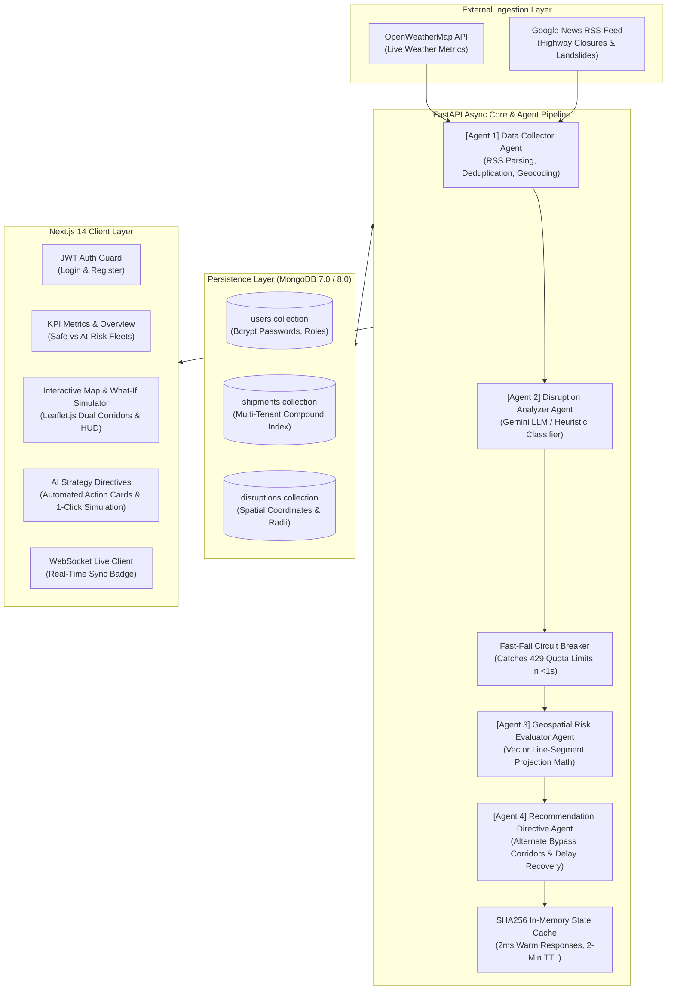
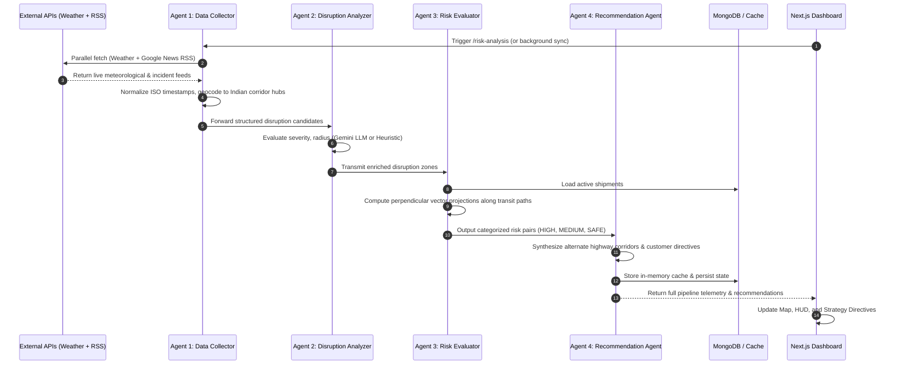

# 🛰️ Logistics Disruption Intelligence Agent: Complete System Architecture & Technical Specification

---

## 1. Executive Overview & Problem Statement

### 1.1 The Domain Problem
In global and domestic supply chain logistics, unpredicted transit bottlenecks account for tens of billions of dollars in lost operational efficiency, SLA penalty fees, perishable cargo spoilage, and emergency driver overtime. 

Traditional Fleet Management Systems (FMS) suffer from three critical architectural flaws:
1. **Passive/Reactive Monitoring:** Traditional GPS tracking alerts dispatchers only *after* a vehicle is stuck in standstill traffic or has arrived hours late.
2. **Radial Proximity Naivety:** Standard geo-fencing checks radial distance from current vehicle coordinates. If an active road closure or landslide is 60 km ahead directly on the vehicle's highway path, radial geofences miss the hazard until the vehicle is within minutes of collision or gridlock.
3. **Black-Box Suggestions Without Visual Proof:** Automated rerouting systems often output cryptic coordinates without visual verification, causing dispatchers and drivers to reject recommendations due to lack of trust.

### 1.2 The Solution
The **Logistics Disruption Intelligence Agent** is an autonomous, agentic supply chain resilience platform. It combines:
- **Live Multi-Source Ingestion:** Real-time environmental metrics (OpenWeatherMap API) and live Google News RSS feeds with ISO-8601 timestamps and NLP entity geocoding across 35+ national highway logistics corridors.
- **True Vector Corridor Projection:** Mathematical vector line-segment projection that evaluates the entire highway path from origin to destination against active hazard zones.
- **4-Agent Autonomous AI Pipeline:** LLM-powered incident severity evaluation, geospatial risk classification, and strategic rerouting directives.
- **High-Availability Fallback & Caching:** A fast-bailout circuit breaker for LLM rate limits (HTTP 429) backed by an expert heuristic engine and a SHA256-keyed in-memory cache delivering 2ms response times.
- **Interactive What-If Route Simulator:** A Leaflet.js dashboard allowing dispatchers to preview primary vs. alternate detour corridors side-by-side with quantified time-saving metrics and formal diversion protocols.

---

## 2. High-Level System Architecture



---

## 3. The 4-Agent Intelligence Pipeline In-Depth

The core processing pipeline decouples responsibilities into four autonomous stages:



### Agent 1: Data Collector Agent (`backend/agents/data_collector.py`)
- **Sources Ingested:**
  - **OpenWeatherMap API:** Queries meteorological parameters across 10+ major Indian logistics hubs (Chennai, Mumbai, Delhi, Kolkata, Bengaluru, Hyderabad, Ahmedabad, Pune, Nagpur, Jaipur). Extracts precipitation, wind speed, cloud cover, and severe weather codes.
  - **Google News RSS Feed:** Live feed queries targeting transport hazards (`"highway accident" OR "highway blocked" OR "expressway closed" OR "landslide" IN`).
- **Entity Geocoding & Deduplication:** Matches raw news titles and location strings against a curated spatial database of 35+ Indian cities, state capitals, and national highway junctions. Deduplicates events by hashing normalized location names and subtypes.

### Agent 2: Disruption Analyzer Agent (`backend/agents/disruption_analyzer.py`)
- **Purpose:** Transforms raw news strings and weather summaries into standardized disruption entities.
- **LLM Integration:** Leverages Google Gemini (`gemini-2.5-flash` / `gemini-1.5-flash`) via structured JSON prompt templates.
- **Pydantic Schema:** Outputs structured objects containing `severity` (`LOW`, `MEDIUM`, `HIGH`, `CRITICAL`), `impact_radius_km` (e.g. 15 km to 60 km), and `expected_duration_hours`.
- **Heuristic Fallback:** If Gemini API keys hit rate limits or timeout, a rule-based expert parser evaluates keywords (`"landslide"`, `"flood"`, `"blocked"`, `"heavy rain"`) to assign deterministic severity scores without interrupting execution.

### Agent 3: Geospatial Risk Evaluator Agent (`backend/agents/risk_evaluator.py`)
- **Purpose:** Determines which active shipments intersect hazard zones.
- **Mathematical Projection:** Executes the `min_distance_to_route_corridor()` vector projection algorithm between the shipment's transit segment (Origin $\to$ Current $\to$ Destination) and the disruption coordinates.
- **Risk Categorization:**
  - **HIGH RISK:** Hazard intersects corridor within $\le 30\text{ km}$, OR high-priority cold-chain cargo with disruption $\le 50\text{ km}$.
  - **MEDIUM RISK:** Hazard within $30\text{ km} < d \le 80\text{ km}$, or minor weather alert along the corridor.
  - **SAFE:** Hazard distance $> 80\text{ km}$ from the travel trajectory.

### Agent 4: Recommendation Agent (`backend/agents/recommendation.py`)
- **Purpose:** Formulates actionable mitigation directives.
- **Output Components:**
  1. `suggested_action`: Immediate dispatcher instruction (e.g., *"Initiate immediate detour via NE4 corridor; alert regional depot"*).
  2. `alternate_route`: Specific bypass highway route (e.g., *"Panvel-Khopoli Diversion via Old Highway"*).
  3. `estimated_delay_hours`: Estimated delay avoided or added.
  4. `customer_message`: Ready-to-send automated SMS/email update for the cargo receiver with revised ETA.

---

## 4. Geospatial & Vector Mathematical Foundations

### 4.1 The Great-Circle Distance (Haversine Formula)
Given two points on Earth $(\phi_1, \lambda_1)$ and $(\phi_2, \lambda_2)$ in radians:
$$\Delta\phi = \phi_2 - \phi_1, \quad \Delta\lambda = \lambda_2 - \lambda_1$$
$$a = \sin^2\left(\frac{\Delta\phi}{2}\right) + \cos(\phi_1)\cos(\phi_2)\sin^2\left(\frac{\Delta\lambda}{2}\right)$$
$$c = 2 \cdot \arctan2\left(\sqrt{a}, \sqrt{1-a}\right)$$
$$d = R \cdot c \quad (\text{where } R \approx 6371.0 \text{ km})$$

### 4.2 Vector Line-Segment Projection onto Highway Corridors
To determine if a disruption $P$ threatens a truck traveling from point $A$ to point $B$:

1. Represent points $A, B, P$ in planar Cartesian coordinates (projected locally via equirectangular approximation around mean latitude $\phi_m$):
   $$x = \Delta\lambda \cdot \cos(\phi_m), \quad y = \Delta\phi$$
2. Let $\vec{u} = \vec{AB}$ and $\vec{v} = \vec{AP}$. The scalar projection parameter $t$ of point $P$ onto the infinite line containing $AB$ is:
   $$t = \frac{\vec{v} \cdot \vec{u}}{\|\vec{u}\|^2} = \frac{v_x u_x + v_y u_y}{u_x^2 + u_y^2}$$
3. Clamp $t$ to the closed line segment $[0, 1]$:
   $$t^* = \max(0, \min(1, t))$$
4. The nearest point $Q$ on the highway segment is:
   $$Q = A + t^* \cdot \vec{AB}$$
5. The minimum corridor distance is:
   $$D_{\text{corridor}}(P, AB) = \text{Haversine}(P, Q)$$

This guarantees that accidents anywhere along the transit path are detected before the vehicle reaches them.

---

## 5. Resilience, Fault Tolerance & Caching Architecture

```
Client Request (GET /api/risk-analysis)
        │
        ▼
Is signature in _MEM_CACHE & age < 120s?
        ├── YES ──► Return Cached JSON (Latency: ~2ms)
        │
        └── NO  ──► Gather Disruption Signals
                        │
                        ▼
                Attempt Gemini LLM
                        ├── HTTP 200 ──► Store LLM Directives
                        │
                        └── HTTP 429 / Timeout (<1s)
                                ├── Circuit Breaker Trips
                                └── Fallback to Expert Heuristic Engine
                                        │
                                        ▼
                                Store in _MEM_CACHE & Return JSON
```

### 5.1 The Fast-Bailout Circuit Breaker
Free-tier and standard enterprise LLM endpoints enforce strict Rate-Limits (HTTP 429). Naive SDK retries cycle across fallback models sequentially, causing 30-second delays that trigger client proxy timeouts (`ECONNRESET`).
- **Solution:** In `gemini_service.py`, any HTTP 429 response triggers an immediate fast-break.
- **Execution Time:** Trips in $< 1\text{ second}$, transferring control to the deterministic rule engine.

### 5.2 Deterministic Expert Heuristic Dispatcher
When AI quota is exhausted, the system does not fail or display blank states:
- Priority weights (Cold Chain = 1.5x, Critical Cargo = 1.3x) evaluate proximity and calculate delays using average highway transit speeds ($45\text{ km/h}$ standard, $65\text{ km/h}$ expressway).
- Produces deterministic, high-quality rerouting directives with 100% uptime.

### 5.3 In-Memory Signature Cache
In `backend/routers/risk_analysis.py`, an in-memory cache hashes the combined state of active shipments and disruption timestamps.
- **Cache Hit:** Returns pre-calculated risk directives in **$2\text{ milliseconds}$**.
- **TTL:** 120 seconds, automatically invalidating when new disruptions or shipments are ingested.

---

## 6. Database Models & Schema Design (MongoDB)

The platform utilizes MongoDB (Motor async driver) with structured Pydantic v2 schemas:

### 6.1 Collections

#### 1. `users`
```json
{
  "_id": "ObjectId(...)",
  "email": "operator@logistics.io",
  "name": "Fleet Dispatcher",
  "hashed_password": "$2b$12$...",
  "role": "admin",
  "created_at": "2026-09-16T10:00:00Z"
}
```

#### 2. `shipments`
```json
{
  "_id": "ObjectId(...)",
  "owner_id": "operator@logistics.io",
  "shipment_id": "IND-TRK-1002",
  "origin": "Chennai",
  "destination": "Madurai",
  "route_highway": "NH44",
  "latitude": 12.1200,
  "longitude": 79.1500,
  "status": "IN_TRANSIT",
  "cargo_type": "Electronics",
  "delivery_priority": "HIGH",
  "updated_at": "2026-09-16T12:00:00Z"
}
```
**Index:** Compound unique index on `[("owner_id", 1), ("shipment_id", 1)]` ensuring strict multi-tenant isolation.

#### 3. `disruptions`
```json
{
  "_id": "ObjectId(...)",
  "id": "DIS-8392",
  "type": "WEATHER",
  "subtype": "Heavy Rain & Waterlogging",
  "severity": "HIGH",
  "latitude": 11.9401,
  "longitude": 79.8083,
  "radius_km": 40.0,
  "location": "Viluppuram / NH44 Corridor",
  "description": "Flash flooding causing standstill truck traffic.",
  "timestamp": "2026-09-16T11:45:00Z"
}
```

---

## 7. Frontend Architecture & What-If Route Simulator

The frontend is built with **Next.js 14 (App Router)**, **TypeScript**, and **Tailwind CSS**.

### 7.1 Viewport Isolation & Layout Stability
- The root layout uses `h-screen w-full overflow-hidden`.
- `<Sidebar>` is pinned to `w-64 h-screen flex-shrink-0 sticky top-0`, preventing layout stretching regardless of dataset size.
- Scrolling is restricted to `<main className="flex-1 h-screen overflow-y-auto">`.

### 7.2 What-If Route Simulator Implementation
- **Map Engine:** `react-leaflet` wrapped in dynamic client-side imports (`ssr: false`).
- **Corridor Dual Polylines:**
  - **Disrupted Path:** `#dc2626` (Red), weight 4.5, dashed `6 6`.
  - **Detour Bypass:** `#0284c7` (Electric Cyan), weight 5.0, dashed `8 6`.
- **Detour Waypoint Graph:**
  - Hardcoded high-speed Indian expressway bypass corridors (e.g., Delhi-Jaipur via NE4/Dausa; Mumbai-Pune via Khopoli; Chennai-Madurai via Trichy NH38).
  - Dynamic perpendicular arch algorithm for arbitrary custom origins/destinations:
    $$\text{MidLat} = \frac{\text{Lat}_A + \text{Lat}_B}{2}, \quad \text{MidLon} = \frac{\text{Lon}_A + \text{Lon}_B}{2}$$
    $$\text{OffsetLat} = \text{MidLat} - \Delta\text{Lon} \cdot 0.22, \quad \text{OffsetLon} = \text{MidLon} + \Delta\text{Lat} \cdot 0.22$$
- **Route Simulator HUD:** Floating card overlay at map top-right displaying:
  - Disrupted corridor bottleneck vs. proposed bypass
  - Averted delay metrics (e.g. saves ~4-6 hrs)
  - Interactive **"Confirm Diversion Protocol"** state toggle button

---

## 8. API Specifications

| Method | Endpoint | Description | Auth Required |
|---|---|---|---|
| `POST` | `/auth/register` | Register new fleet operator | No |
| `POST` | `/auth/login` | Authenticate & retrieve JWT Bearer token | No |
| `GET` | `/auth/me` | Fetch authenticated user profile | Bearer JWT |
| `GET` | `/shipments` | Fetch all active shipments for tenant | Bearer JWT |
| `POST` | `/shipments` | Create a new active tracking shipment | Bearer JWT |
| `POST` | `/shipments/seed-demo` | Seed 15 representative Indian transit trucks | Bearer JWT |
| `GET` | `/disruptions` | Ingest and return live weather & RSS disruptions | Optional |
| `GET` | `/risk-analysis` | Execute 4-agent pipeline or return cached analysis | Optional |
| `WS` | `/ws/risk-updates` | WebSocket channel for real-time fleet sync | Token Param |

---

## 9. Production Scalability & Future Roadmap

To scale this platform to 100,000+ active enterprise vehicles:

1. **Spatial Indexing via Uber H3:**
   - Discretize road networks into H3 hexagonal indices (resolution 7, ~1.2 km edge length).
   - In-memory spatial hash lookups reduce corridor evaluation complexity from $O(N \times M)$ to $O(1)$ cell intersections.
2. **Event Streaming with Apache Kafka:**
   - Ingest high-frequency telematics GPS pings into partitioned Kafka topics (`telematics.truck-gps`).
   - Stream-processing microservices evaluate corridor boundaries continuously.
3. **Turn-by-Turn Telematics Routing Engine (OSRM / TomTom API):**
   - Replace geometric detour waypoints with road-network routing engines that enforce truck bridge clearances, gross vehicle weight (GVW) restrictions, and toll optimizations.
4. **Automated Driver Dispatch:**
   - Dispatcher confirmation on the HUD triggers automated WhatsApp Business API / Twilio SMS messages delivering turn-by-turn bypass links directly to the driver's phone.
